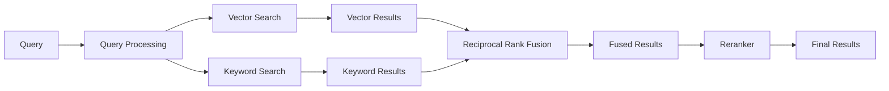
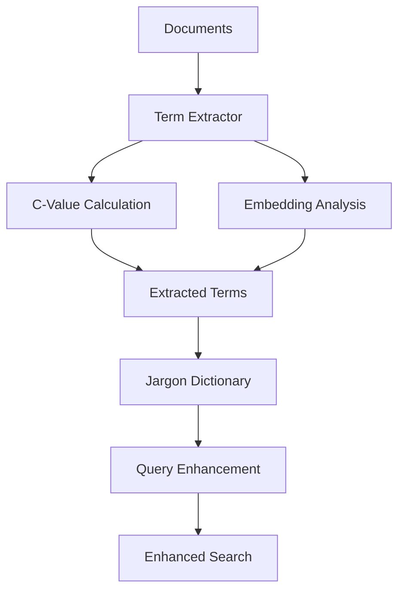

# 高度なRAGシステム (iRAG)

## 概要

このシステムは、文書検索とSQL検索を統合した高度なRAG（Retrieval-Augmented Generation）システムです。Streamlitベースの直感的なUIを提供し、Azure OpenAI Serviceを活用して、多言語対応の自然言語処理による強力な情報検索と質問応答を実現します。データ（CSV/Excel）に対するSQL検索も同時にします。

## 🎯 リファクタリング完了

2025年8月29日に大規模なフォルダ構成リファクタリングを実施し、可読性と改修性を大幅に向上させました。

### ✨ 改善点
- **関心の分離**: 機能別にフォルダを整理し、各モジュールの責任を明確化
- **改修性向上**: 関連ファイルを近接配置し、変更影響範囲を明確化
- **テスト容易性**: 構造化によりユニットテスト作成が容易に
- **新規開発者対応**: 直感的な構造で理解しやすく

## 主な機能

- **ハイブリッド検索**: ベクトル検索とキーワード検索を組み合わせ、Reciprocal Rank Fusion (RRF) によって検索精度を向上させます。
- **日本語特化**: SudachiPyによる日本語形態素解析を使用し、日本語の文書処理に最適化されたハイブリッド検索を実現します。
- **Text-to-SQL**: 自然言語のクエリを解析し、アップロードされたCSV/Excelファイルからのデータベースファイルに対して自動的にSQLクエリを生成します。
- **専門用語辞書 (Golden-Retriever)**: アップロードから専門用語をその定義を抽出し、辞書を構築。この辞書を用いてクエリの理解を深め、よりコンテキストに沿った回答を生成します。
- **評価システム**: Recall、Precision、MRR、nDCG、Hit Rateなどの指標でRAGシステムの検索精度を定量的に評価できます。
- **ユーザーフレンドリーなUI**: タブ構成のインターフェース、メッセージ履歴、ドキュメント管理など、使いやすいストリームリットアプリケーションと洗練された設計です。

## システム構成

システムは大きく以下のコンポーネントから構成されています：

```
.
├── app.py                      # Streamlitアプリケーションのエントリポイント
├── requirements.txt            # 必要なPythonライブラリ
├── .env.example                # 環境変数の設定テンプレート
├── src/                        # メインソースコード
│   ├── core/                   # コアビジネスロジック
│   │   └── rag_system.py       # RAGシステムのファサード
│   ├── rag/                    # RAGシステムのコアモジュール
│   │   ├── chains.py           # LangChainのチェーンとプロンプト設定
│   │   ├── config.py           # 設定ファイル(Config)
│   │   ├── evaluator.py        # 評価システムモジュール
│   │   ├── ingestion.py        # ドキュメントの取り込みと処理
│   │   ├── jargon.py           # 専門用語辞書の管理
│   │   ├── retriever.py        # ハイブリッド検索リトリーバー
│   │   ├── sql_handler.py      # Text-to-SQL機能の処理
│   │   └── text_processor.py   # 日本語テキスト処理
│   ├── ui/                     # UIコンポーネント
│   │   ├── chat_tab.py         # チャット画面
│   │   ├── data_tab.py         # データ管理画面
│   │   ├── dictionary_tab.py   # 辞書管理画面
│   │   ├── documents_tab.py    # ドキュメント管理画面
│   │   ├── evaluation_tab.py   # 評価システム画面
│   │   ├── settings_tab.py     # 設定画面
│   │   ├── sidebar.py          # サイドバー
│   │   └── state.py            # セッション状態管理
│   ├── evaluation/             # 評価システム
│   │   ├── evaluator.py        # 評価メインスクリプト
│   │   ├── test_scenarios.py   # テストシナリオ
│   │   └── test_questions.csv  # 評価用データ
│   ├── scripts/                # 拡張スクリプト
│   │   ├── term_extract.py     # 専門用語抽出
│   │   ├── term_extractor_embeding.py
│   │   ├── term_extractor_with_c_value.py
│   │   └── test_synonym_detection.py
│   └── utils/                  # ユーティリティ関数
│       ├── helpers.py          # ヘルパー関数
│       └── style.py            # UIスタイル設定
├── docs/                       # ドキュメント
│   ├── evaluation/             # 評価関連ドキュメント
│   └── architecture/           # アーキテクチャドキュメント
└── output/                     # 出力ファイル
    ├── images/                 # 生成された画像
    └── terms.json              # 抽出された専門用語
```

## インストール手順

1. **仮想環境の作成と有効化**:
    ```bash
    python -m venv myenv
    source myenv/bin/activate   # Linux/macOS
    myenv\Scripts\activate       # Windows
    ```

2. **依存関係のインストール**:
    ```bash
    pip install -r requirements.txt
    ```

3. **環境変数の設定**:
    `.env.example` ファイルをコピーして `.env` ファイルを作成し、以下の設定を記入してください。最低限、以下の設定が必要です。
    - `AZURE_OPENAI_API_KEY`
    - `AZURE_OPENAI_ENDPOINT`
    - `AZURE_OPENAI_CHAT_DEPLOYMENT_NAME`
    - `AZURE_OPENAI_EMBEDDING_DEPLOYMENT_NAME`
    - `PG_URL` (PostgreSQLの接続URL) または `DB_*` の各項目

## 使い方

以下のコマンドでStreamlitアプリケーションを起動します。

```bash
streamlit run app.py
```

## 評価システムの使用方法

RAGシステムの検索精度を評価するには、以下のスクリプトを実行します：

```bash
python src/evaluation/evaluator.py
```

### 評価機能の特徴

- **複数の評価指標**: 
  - Recall@K: 関連文書の再現率
  - Precision@K: 検索結果の精度
  - MRR (Mean Reciprocal Rank): 平均逆順位
  - nDCG (Normalized Discounted Cumulative Gain): 正規化減損累積利得
  - Hit Rate@K: ヒット率

- **複数の類似度計算手法**:
  - Azure Embedding: 埋め込みベースの類似度
  - Azure LLM: LLMベースの類似度判定
  - Text Overlap: テキストの重複度
  - Hybrid: 複数手法の組み合わせ

- **柔軟な評価方法**:
  - CSVファイルからの評価データ読み込み
  - プログラムでの直接評価
  - 結果のCSVエクスポート

### 評価データの形式

CSVファイルは以下の形式で準備してください：
- `質問`: 評価用の質問
- `想定の引用元1`, `想定の引用元2`, ...: 期待される情報源
- `チャンク1`, `チャンク2`, ...: 検索結果（オプション）

## アーキテクチャ概要

### システム全体構成

```mermaid
graph TB
    subgraph "Frontend Layer"
        UI[Streamlit UI]
        UI --> ST[State Manager]
    end
    
    subgraph "Application Layer"
        ST --> APP[app.py]
        APP --> TABS[UI Tabs]
        TABS --> CT[Chat Tab]
        TABS --> DT[Data Tab]
        TABS --> DICT[Dictionary Tab]
        TABS --> DOC[Documents Tab]
        TABS --> SET[Settings Tab]
    end
    
    subgraph "RAG Core Engine"
        CT --> CHAIN[LangChain Chains]
        CHAIN --> RET[Hybrid Retriever]
        RET --> VS[Vector Store]
        RET --> KS[Keyword Search]
        RET --> RRF[RRF Fusion]
        
        CHAIN --> SQL[SQL Handler]
        SQL --> CSV[CSV/Excel Parser]
        
        CHAIN --> JARGON[Jargon Dictionary]
        JARGON --> TERMEX[Term Extractor]
    end
    
    subgraph "Data Layer"
        VS --> PG[(PostgreSQL + pgvector)]
        SQL --> SQLITE[(SQLite)]
        JARGON --> JSON[(JSON Store)]
    end
    
    subgraph "External Services"
        CHAIN --> AZURE[Azure OpenAI]
        AZURE --> GPT[GPT-4o]
        AZURE --> EMBED[text-embedding-ada-002]
    end
    
    subgraph "Evaluation System"
        EVAL[Evaluator] --> METRICS[Metrics Calculator]
        METRICS --> RECALL[Recall@K]
        METRICS --> PRECISION[Precision@K]
        METRICS --> MRR[MRR]
        METRICS --> NDCG[nDCG]
        METRICS --> HR[Hit Rate@K]
    end
```

### ハイブリッド検索の仕組み



### 専門用語辞書システム



## 技術仕様

- **フロントエンド**: Streamlit
- **バックエンド**: Python 3.9+
- **ベクトルデータベース**: PostgreSQL + pgvector
- **言語モデル**: Azure OpenAI (GPT-4o, text-embedding-ada-002)
- **日本語処理**: SudachiPy
- **検索エンジン**: LangChain + カスタムハイブリッドリトリーバー

## ライセンス

このプロジェクトはMITライセンスの下で公開されています。