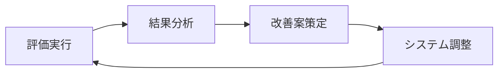

# RAGシステム評価ガイド

本ドキュメントでは、RAGシステムの評価機能の詳細な使用方法と、提供される評価データサンプルについて説明します。

## 📁 評価関連ファイル

```
evaluation/
├── evaluate_rag.py                    # メイン評価スクリプト
├── evaluation_test_scenarios.py       # 多様な評価シナリオ
├── evaluation_data_sample.csv         # 基本的な評価データサンプル
├── evaluation_data_advanced.csv       # 高度な評価データサンプル
└── EVALUATION_README.md              # このファイル
```

## 🚀 クイックスタート

### 1. 基本的な評価の実行

```bash
# サンプルデータを使用した基本評価
python evaluate_rag.py
```

### 2. 包括的なシナリオ評価

```bash
# 多様なシナリオでの詳細評価
python evaluation_test_scenarios.py
```

## 📊 評価指標の説明

### 主要指標

| 指標 | 説明 | 計算方法 | 最適値 |
|-----|-----|---------|--------|
| **Recall@K** | 関連文書の再現率 | 発見された関連文書数 / 全関連文書数 | 1.0 |
| **Precision@K** | 検索結果の精度 | 関連する検索結果数 / 検索結果総数 | 1.0 |
| **MRR** | 平均逆順位 | 1/最初の関連文書の順位 の平均 | 1.0 |
| **nDCG@K** | 正規化減損累積利得 | DCG / IDCG | 1.0 |
| **Hit Rate@K** | ヒット率 | 関連文書が見つかったクエリ数 / 全クエリ数 | 1.0 |

### 指標の解釈

- **Recall@K**: 期待される関連文書のうち、上位K件の検索結果に含まれる割合
- **Precision@K**: 上位K件の検索結果のうち、実際に関連する文書の割合
- **MRR**: 最初に関連する文書が現れる順位の逆数の平均
- **nDCG@K**: 順位を考慮した検索品質の指標（上位ほど重要）
- **Hit Rate@K**: 上位K件に少なくとも1つの関連文書が含まれるクエリの割合

## 🔧 設定と閾値

### 信頼性閾値の設定

信頼性閾値は`.env`ファイルで設定可能です：

```env
CONFIDENCE_THRESHOLD=0.7  # デフォルト: 0.7
```

- **0.7-0.9**: 高精度（厳格な評価）
- **0.5-0.7**: バランス型
- **0.3-0.5**: 高再現率（寛容な評価）

### その他の主要設定

```env
VECTOR_SEARCH_K=10        # ベクトル検索取得数
KEYWORD_SEARCH_K=10       # キーワード検索取得数
FINAL_K=5                 # 最終出力数
COLLECTION_NAME=documents # コレクション名
```

## 🔍 類似度計算手法

### 利用可能な手法

1. **azure_embedding** (推奨)
   - Azure OpenAI text-embedding-3-small モデル使用
   - コサイン類似度で計算
   - 意味的類似性を効果的に捕捉
   - 現在のシステム設定に最適化

2. **azure_llm**
   - Azure OpenAI GPT-4o による直接判定
   - より人間に近い判断
   - API使用量が多い

3. **text_overlap**
   - 単語の重複度による計算
   - 高速で計算コストが低い
   - 語彙レベルの類似性のみ

4. **hybrid**
   - Embedding (70%) + Text Overlap (30%)
   - バランスの取れたアプローチ

## 📋 評価データの形式

### CSV形式

```csv
質問,想定の引用元1,想定の引用元2,想定の引用元3,チャンク1,チャンク2,チャンク3
RAGとは何ですか？,RAGは検索拡張生成の略です,外部知識を活用する手法です,精度向上に効果的です,データ: RAG概要---...,データ: RAG利点---...,データ: RAG実装---...
```

### フィールドの説明

- **質問**: 評価対象のクエリ
- **想定の引用元N**: 期待される情報源や回答内容
- **チャンクN**: システムが検索する文書片（オプション）

## 📁 提供データサンプル

### evaluation_data_sample.csv
基本的なRAG概念に関する10の質問を含む標準的な評価データセット

**含まれるトピック:**
- RAGの基本概念
- ベクトル検索
- ハイブリッド検索
- リランキング
- チャンキング
- Query Expansion
- プロンプトエンジニアリング

### evaluation_data_advanced.csv
より高度で技術的な内容を含む評価データセット

**含まれるトピック:**
- Azure OpenAI料金体系
- PostgreSQL/pgvector最適化
- 日本語トークナイゼーション
- Streamlit状態管理
- LangChainカスタムチェーン
- 大規模データセット最適化
- セキュリティ考慮事項
- マルチモーダルRAG

## 🎯 評価シナリオ

### evaluation_test_scenarios.py で定義されるシナリオ

1. **basic_rag**: RAGの基本概念
2. **technical**: 技術的実装詳細
3. **advanced**: 高度なトピック
4. **edge_cases**: エッジケースと困難なシナリオ
5. **evaluation**: 評価手法自体について
6. **japanese_nlp**: 日本語処理特有の課題
7. **performance**: パフォーマンスとスケーラビリティ

## 🛠 カスタム評価の実行

### プログラムでの評価

```python
import asyncio
from rag.config import Config
from rag_system_enhanced import RAGSystem

async def custom_evaluation():
    # RAGシステムの初期化
    config = Config()
    rag_system = RAGSystem(config)
    
    # カスタム質問の定義
    test_questions = [
        {
            'question': 'あなたの質問',
            'expected_sources': [
                '期待される回答1',
                '期待される回答2'
            ]
        }
    ]
    
    # 評価の実行
    metrics = await rag_system.evaluate_system(
        test_questions=test_questions,
        similarity_method="azure_embedding",
        export_path="my_evaluation.csv"
    )
    
    print(f"MRR: {metrics.mrr:.4f}")
    print(f"Recall@5: {metrics.recall_at_k.get(5, 0):.4f}")

# 実行
asyncio.run(custom_evaluation())
```

### CSVファイルからの評価

```python
async def csv_evaluation():
    config = Config()
    rag_system = RAGSystem(config)
    
    # CSVファイルから評価
    results = await rag_system.evaluate_from_csv(
        csv_path="my_evaluation_data.csv",
        similarity_method="azure_embedding",
        export_path="results.csv"
    )
    
    print(f"評価完了: {len(results)}件の質問を処理")
```

## 📈 結果の解釈とアクション

### 良いスコアの目安

| 指標 | 良好 | 普通 | 改善必要 |
|-----|-----|------|---------|
| Recall@5 | >0.8 | 0.6-0.8 | <0.6 |
| Precision@5 | >0.6 | 0.4-0.6 | <0.4 |
| MRR | >0.7 | 0.5-0.7 | <0.5 |
| nDCG@5 | >0.7 | 0.5-0.7 | <0.5 |

### スコアが低い場合の対策

#### Recallが低い場合
- チャンクサイズを調整
- 類似度閾値を下げる
- Query Expansionを有効化
- より多くの文書を検索対象に

#### Precisionが低い場合
- リランキングを有効化
- 類似度閾値を上げる
- より精密なクエリを生成
- 関連性の低い文書を除外

#### MRRが低い場合
- 検索アルゴリズムの調整
- より適切なインデックス構造
- クエリの意図理解を改善

## 🔧 パフォーマンス最適化

### 評価速度の向上

```python
# 並列評価の設定
evaluator = RAGEvaluator(
    config=config,
    api_delay=0.05,  # API遅延を短縮（レート制限に注意）
    similarity_method="text_overlap"  # 高速な手法を使用
)
```

### メモリ使用量の削減

```python
# 小さなK値を使用
evaluator = RAGEvaluator(
    config=config,
    k_values=[1, 3, 5],  # 大きなK値を避ける
    similarity_threshold=0.6  # 適切な閾値設定
)
```

## 🐛 トラブルシューティング

### よくある問題と解決方法

#### 1. API制限エラー
```python
# API遅延を増加
evaluator = RAGEvaluator(config=config, api_delay=1.0)
```

#### 2. メモリ不足
```python
# バッチサイズを削減
# 少数の質問ずつ処理
```

#### 3. 類似度計算エラー
```python
# フォールバック手法を使用
try:
    # Azure Embedding
except:
    # Text Overlap にフォールバック
```

## 📝 評価レポートの生成

### 自動レポート機能

```python
# 包括的評価レポートの生成
metrics = await rag_system.run_comprehensive_evaluation(
    test_questions=questions,
    methods=["azure_embedding", "azure_llm", "hybrid"],
    export_path="comprehensive_report.csv"
)

# 結果の可視化
import matplotlib.pyplot as plt
import pandas as pd

# グラフ生成コード例...
```

## 🚀 継続的改善

### 評価の自動化

1. **定期評価**: 週次/月次での自動評価実行
2. **A/Bテスト**: 異なる設定での比較評価
3. **回帰テスト**: システム更新時の性能確認
4. **ベンチマーク**: 他システムとの比較評価

### フィードバックループ



## 📞 サポート

問題が発生した場合は以下を確認してください：

1. **環境変数**: Azure OpenAI設定が正しいか
2. **依存関係**: 必要なライブラリがインストールされているか
3. **データ形式**: CSVファイルの形式が正しいか
4. **権限**: ファイルの読み書き権限があるか

詳細なログとエラー情報を含めてGitHubのissuesに報告してください。